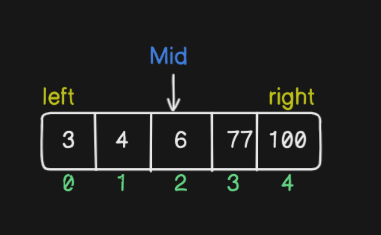

# Binary Search
### This searching method works with sorted array.It works by repeatedly dividing the search interval in half until the target index value is found or the interval is empty.

### Steps
1. First find the mid: length/2(middle index)
2. Assign left and right: left will be first index and right will be last index

3. if target index value is less than mid then index values of left will be same but index value of right will become (middle-1) means one less than mid 
4. if target index value is greater than mid then index values of left will (middle+1) but index value of right will remain same.
5. compare mid with target if found return the index